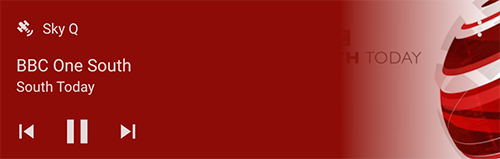
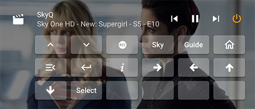
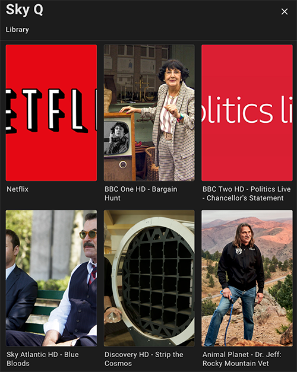

# Sky Q component for Home Assistant

The skyq platform allows you to control a Sky Q set top box.

**Note:** This integration does not support **Sky Glass** or internet only devices that are currently being sold outside the UK.

**Note:** The integration supports Sky Q in the UK (and Ireland using the same EPG), Germany and Italy.

There is currently support for the following device types within Home Assistant:

- [Media Player](./media_player_entity_attributes.md)
- [Sensor](./storage_sensor.md) (UI config only)

## Screenshots

_Component showing current TV with default media control_

_Component showing application with default media control_

_Component showing recording with [Mini Media Player](https://github.com/kalkih/mini-media-player)_

_Media Browser_

