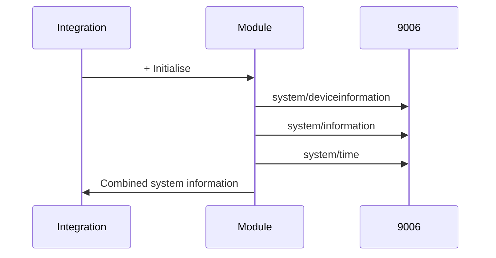
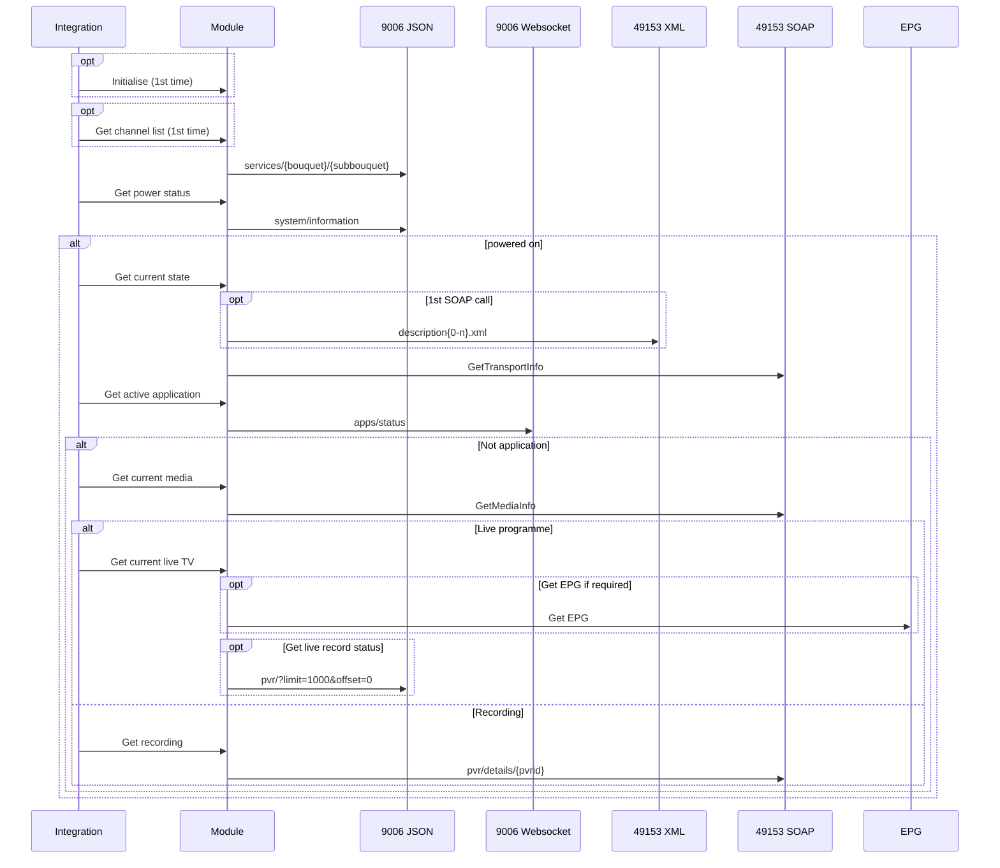

# Key sequences

## Initialise sequence



## Update sequence



## Quota sequence

```mermaid
sequenceDiagram
participant I as Integration
participant M as Module
participant J as 9006 JSON
I->>M: Get quota
M->>J: pvr/storage
