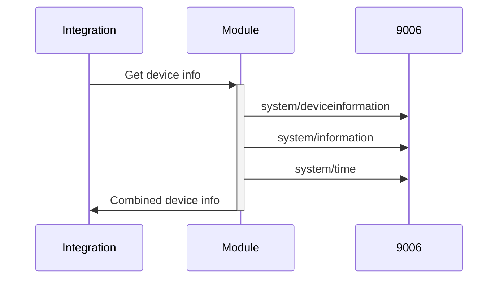
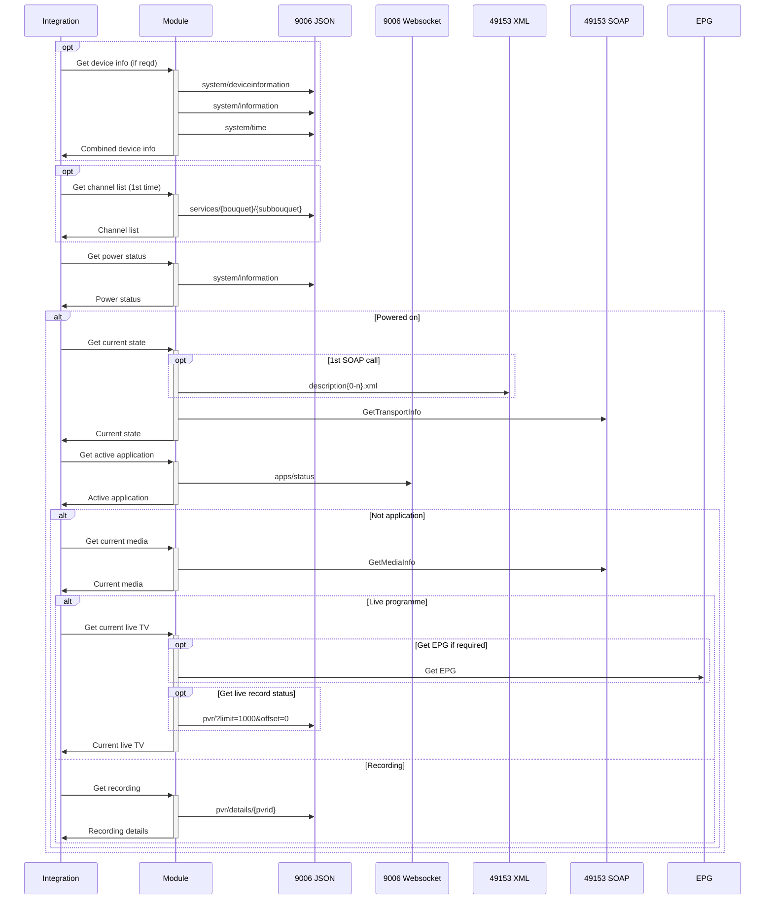
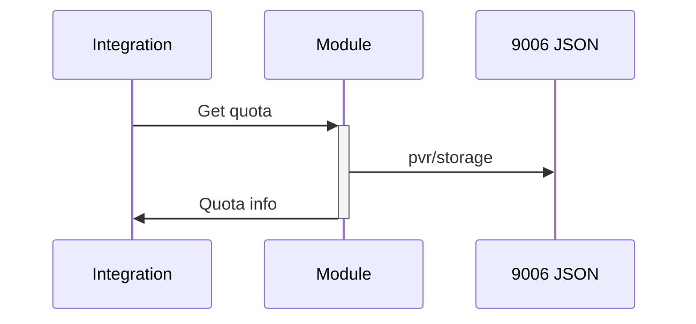
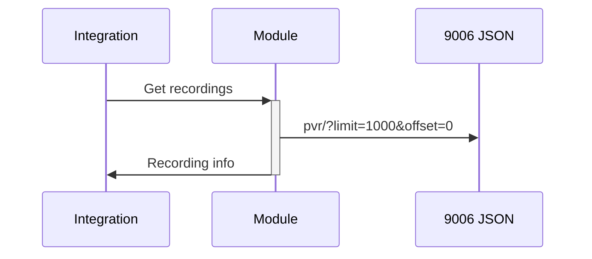

# Key sequences

## Initialise sequence

```mermaid
sequenceDiagram
participant I as Integration
participant M as Module
participant J as 9006
I->>+M: Get device info
M->>J: system/deviceinformation
M->>J: system/information
M->>J: system/time
M->>-I: Combined device info
```

## Update sequence

```mermaid
sequenceDiagram
participant I as Integration
participant M as Module
participant J as 9006 JSON
participant W as 9006 Websocket
participant X as 49153 XML
participant S as 49153 SOAP
participant W as 9006 Websocket
participant E as EPG
opt
  I->>+M: Get device info (if reqd)
  M->>J: system/deviceinformation
  M->>J: system/information
  M->>J: system/time
  M->>-I: Combined device info
end
opt
  I->>+M: Get channel list (1st time)
  M->>J: services/{bouquet}/{subbouquet}
  M->>-I: Channel list
end
I->>+M: Get power status
M->>J: system/information
M->>-I: Power status
alt Powered on
  I->>+M: Get current state
  opt 1st SOAP call
    M->>X: description{0-n}.xml
  end
  M->>S: GetTransportInfo
  M->>-I: Current state
  I->>+M: Get active application
  M->>W: apps/status
  M->>-I: Active application
  alt Not application
    I->>+M: Get current media
    M->>S: GetMediaInfo
    M->>-I: Current media
    alt Live programme
      I->>+M: Get current live TV
      opt Get EPG if required
        M->>E: Get EPG
      end
      opt Get live record status
        M->>J: pvr/?limit=1000&offset=0
      end
      M->>-I: Current live TV
    else Recording
      I->>+M: Get recording
      M->>J: pvr/details/{pvrid}
      M->>-I: Recording details
    end
  end
end
```

## Quota sequence

```mermaid
sequenceDiagram
participant I as Integration
participant M as Module
participant J as 9006 JSON
I->>+M: Get quota
M->>J: pvr/storage
M->>-I: Quota info
```

## Scheduled recordings

```mermaid
sequenceDiagram
participant I as Integration
participant M as Module
participant J as 9006 JSON
I->>+M: Get recordings
M->>J: pvr/?limit=1000&offset=0
M->>-I: Recording info
```
